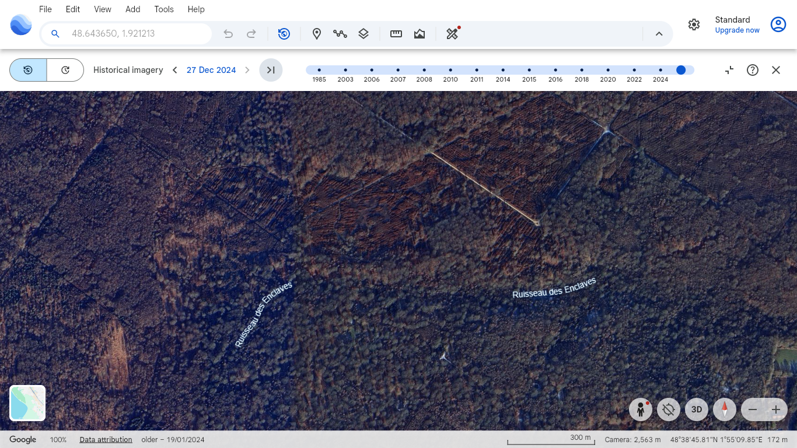
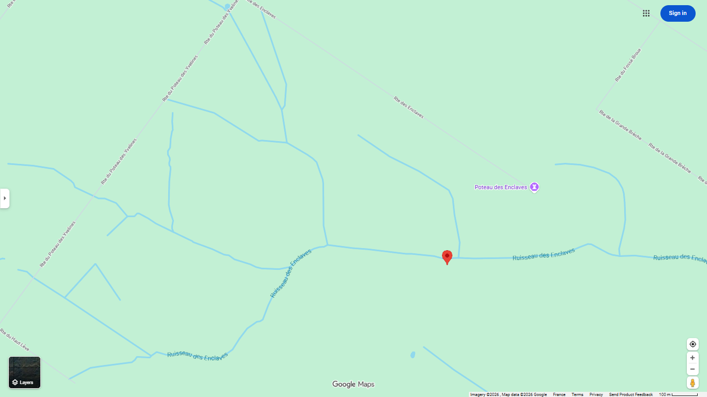
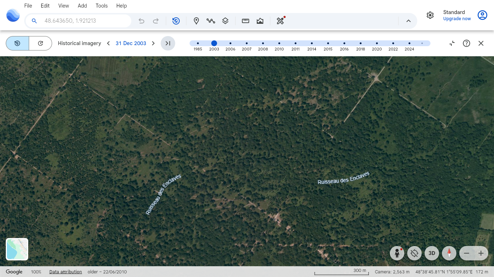
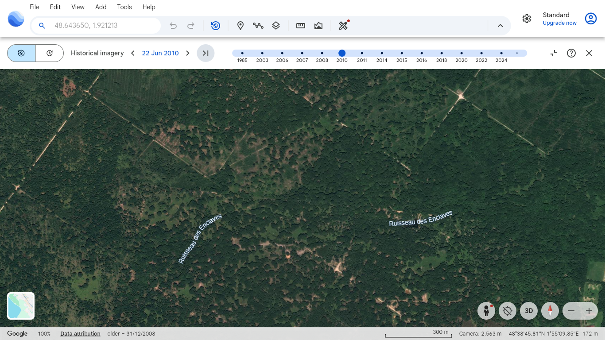
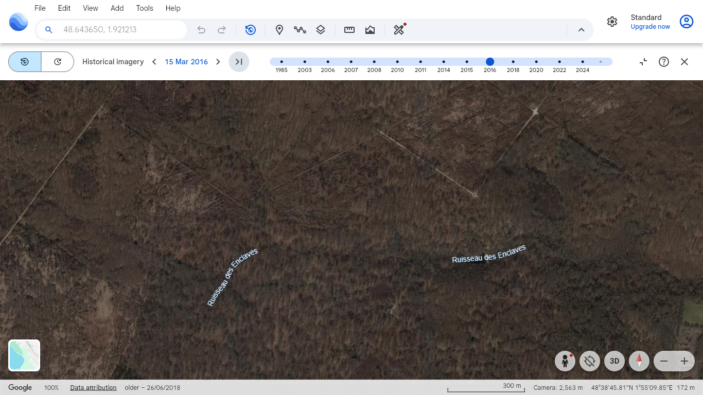

The task is to get satellite imagery for path planning. Ideally, altitude and transit (map) data should also be obtained.

Now, this applet allows to make large high-resolution images by autonomously interacting with google maps.

# How to use

- Choose a location on your computer and clone the repository there: `git clone https://github.com/Gleb-05/GoogleMapsClicker.git`
- Make venv in the root dir: `python -m venv venv`
- Still in root dir, activate venv:
  - windows: `venv\Scripts\Activate.ps1`
  - linux: `source venv/bin/activate`
- Install required dependencies inside venv: `pip install -r requirements.txt`
- Open google maps in a new chrome window as the only tab. 
  Google maps should take up the entire screen.
- Run `python run.py`.
- Choose between `Get Area Img` and `Edit Configs`:
  - `Get Area Img` exposes a single function: [`get_dd_rect_img`](usr_get_area_img.py). It allows to compose large map regions into image files (they are saved with coordinates in their name for reproducibility).
    - If you want to hault any GUI operation, quickly move your cursor to one of the screen corners.
  - `Edit Configs` allows to tailor the app to your needs. Mainly to different display sizes.
    - config titles with a magnifying glass can be clicked to view their hint images
    - configs can be saved to files, and you can choose which config to use by default in preferences.

See examples of using `get_dd_rect_img` (dd = decimal degrees).
In [`map_regions`](./map_regions) both map and sat view of Beynes France AND Camp militaire de Mailly can be found.

*During active development, use `python -m tk_app_frames.debug` to check things out quickly.*

## Stats

The largest region yet (Camp militaire de Mailly) takes 17x39 entire 1204x579 areas, which takes (thanks to explicit uint8 typing) about 20 minutes to compose and about 1.4 Gigabytes of memory (800 Mb after being saved as png). It covers about 250 square kilometers, which seems like more than enough for research purposes. Please be mindful of how heavy the images are and how much time they require.

## App use disclaimers

DEFAULT VALUES WORK WITH A 1366x768 DISPLAY, BUT `Edit Configs` HAS GUIDELINES (and illustrations) TO CHANGE THEM

dd = decimal degrees

Consider that the app is intentionally top-level, meaning it won't disappear when you click outside it. Minimize by hand when needed.

Consider that many buttons in the middle of the app (a frame with a grooved border) do not work immediately, because operations they execute require some preparation. After being clicked, buttons change color and wait for a key press. It is either cancel (esc) or proceed (shift or num lk) the User has to choose from.  
Minimize the app before pressing proceed keys at your own discretion. The app will minimize automatically if the button requires it internally.

Consider that all entries operate on a json representation of the values they store. That is, the app exposes all pure values to the user through `json.dumps` and extracts pure values from the interface through `json.loads`. Inernally, get and set of a given entry is manually *jsonified* (`entry.set(json.dumps(value))` and, as inverse, `value = json.loads(entry.get())`). The only exception is [tk.StringVar](z_app_components/json_string_var.py), made for better UX.

# Brief overview of functionality

general-purpose:
- visit places with known decimal degree coordinates through addressbar
- use f3 find
- use chrome devtools `inspect` to seek elements on the page
- interact with chrome devtools console
- drag the map
- get coordinates of any point within the visible area
- scroll the search results
- use google maps search bar
- collapse and expand sidepanel

Interesting:
- To increase resilience, [`wait_contexts.py`](./wait_contexts.py) was made. Instead of using constant time.sleep values, with contexts it is possible to wait for
  - screen change
  - animation end
  - appearance of an image
- To decrease dependency on exact screen dimensions and positions of GUI elements within it, more and more functions rely on the console. Most buttons can be clicked from the console, most values can be extracted as attributes from the console.
- A single config registry is created to manage config values used in methods all over the codebase.
  - Configs (say, for different displays) and preferences (shall be persisted) are differentiated, but can be changed through the same interface of `Edit Configs`.
- Sometimes mouse clicking or pressing a button is not enough. [`KeypressPublisher` and `ButtonKeyboardManager`](./z_app_components/keypress_publisher.py) work together to make sure that:
  - User has the ability to choose an operation and do stuff before it's executed using special buttons.
  - One button - one operation.
  - After the button is pressed, it begins to wait for a key press.
  - Many buttons can be configured to safely wait for the key press.
  - Only one operation will be executed if a "proceed" key is pressed, regardless of how many buttons were pressed.
- Large images can be separated into smaller slices with `slice_large_image` and `unslice_large_image` in [`utils.py`](utils.py)*

More can be found in docstrings and `.md` files

# TODOs

- Incremental coverage of large regions, with ability to choose starting areas using tqdm indexing and logging?
- If the region is too large, instead of using `utils.slice_large_region`, calculate corners of smaller rectangle sub-regions and pass them to `get_dd_rect_img` to get multiple smaller files in a folder?
- Read sets of region-defining decimal degree coordinates from a text file, estimate memory-time, begin execution after user confirmation?

# Problem overview

The most obvious solution for path planning is **Google Maps**.
Using its API requires a setup with a credit card. Additionally, there is a limit on how many API calls can be made with a Free tier account, and the amount appears to be rather restricting. However, the Google Maps API provides a wide range of data in a clear and structured format, enabling data extraction within seconds. Compared to other options, it still may be worthwhile to perform a one-time comprehensive data extraction.

Extracting information from Google Maps without API is still possible through automation of GUI (graphical user interface).
GUI Automation is linked to its own challenges, amongst which:
- fragile setup: the interface changes on different screens, turning many variables inaccurate.
- uncertainty in variable usage: variables introduced for one context are often reused elsewhere, but as the codebase expands, developers may create redundant variables due to limited awareness of existing ones.
- unreliable behavior: sometimes correct code doesn't work on first try, only after two or more repeated executions the code resumes working as expected.
- abundance of failsafes: the logic for "waiting for page updates" or "repeating some actions" should be applied to all new code, which makes the development of new functionality difficult.
- graphical data: while other tools allow to download relevant data as a collection of points or values, GUI automation can only produce screenshots.

Ignoring the downsides, GUI automation allows to extract high-quality graphical data at the expence of time. One computer can be left to work continuously for a week, but yield terrain and transit data for a large area from Google Maps as a result.

Notice that terrain and transit data may not be enough to arrive at optimal path planning. **See (48.643650, 1.921213) as an example**. The terrain by itself fails to capture the presence of a river that cannot be crossed. The bottom right area relative to the point doesn't appear to have roads. And transit data reinforces this evaluation of the area.

| Year | Image |
| ---: | ----- |
| 2024 |  |
| 2024 |   |

Using *historical satellite imagery* should be useful, allowing to infer where the roads are based on the regions of stability. Consider the following five images, with the last one being from Google Maps:

The areas to the left and to the right of the point clearly have roads that were neither marked nor visible on Google Maps. Additionally, in earlier years the division of the area into rectangles is much more apparent.

| Year | Image |
| ---: | ----- |
| 2003 |  |
| 2010 |  |
| 2016 |  |

The task of downloading historical satellite imagery seems to be common (https://gis.stackexchange.com/questions/340605/mass-downloading-google-earth-historical-imagery). Apart from Google Earth, [Landsat](https://developers.google.com/earth-engine/datasets/catalog/landsat) and [Sentinel](https://developers.google.com/earth-engine/datasets/catalog/sentinel) are suggested.

If existing solutions fail, this repository may be extended to work with Google Earth via GUI automation. However, due to its significant limitations, other methods of obtaining the relevant data should be prioritized.

Moving away from solutions provided by Google:
- https://www.openstreetbrowser.org/
- https://www.openstreetmap.org/
- https://www.geoportail.gouv.fr/

Those solutions provide the same kinds of data, but they are open-sourced.

While working with images it became apparent that some map regions have low dencity of meaningful elements (roads and bodies of water). It makes saving those regions to an image highly inefficient. Alternative representations of meaningful elements (graphs, polygons) to be researched for map view.

# Image processing (brief)

To evaluate how traversible the area is, classic computer vision and convolutional neural networks are the first things to try.

With classic computer vision, the sat view can be preprocessed, and custom features can be derived. Example features include: color uniformity, dominance of green, noisiness, rgb variance, clear edges, connected edges. The features  can be statisctically evaluated to differentiate terrain types, can be used for clustering, thresholding, segmenting and so on. It is even possible to label pixel regions by hand and train a machine learnig classifier (like Random Forest or XGBoost).

Pros:
- easy to come up with a naive computer vision pipeline that works good enough on a given area.
Cons:
- naive approach works only for the most basic of features, and it requires calibration that breaks outside the given area.

It is possible to come up with a set of clever features that combine information about color, edges, and neighboring pixels. However, this is exactly what convolutional nerual networks accomplish. **In terms of time, spending it on CNNs promises to yield more results.**

Using CNNs for analising aerial images is relatively new, but developed nonetheless. It is possible to find pretrained models that differentiate low vegetation from high vegetation and detect walking paths beyond the paved roads. In case none of those work, it is possible to train your own CNN. The *U-Net with a ResNet encoder pretrained on ImageNet (segmentation_models_pytorch?)* is a default choice to make a good segmentation model with not a lot of data.

Now, the reason why both map and sat views of the same region are obtained is as follows. Preprocessing the map view allows to get pixels for water, roads and paths. There are many regions where all three of those are under tree foliage, making both computer vision and deep learning unapplicable. Utilizing the information from map view allows to bypass the limitations of sat view and meaningfully augment it for best possible path planning.

# Path planning (brief)

Minimal framework for path planning after terrain classification:

- Assign traversability value intervals to different types of terrain, where 0 is fully traversable and 1 is completely untraversable.

- After the type of terrain if determined, each pixel can be assigned a traversability value.

  - Steeper places will get values closer to the upper bound of the respective traversability value interval

  - It is possible to quantify relationships like "15 degrees in low vegetation is like 0 degrees in high vegetation" and assign values accordingly. The capability to parametrize those relationships should be factored in from the start (since different autonomous vehicles have different relationships with the terrain)

  - Types like "forest" should be penalized or derived from neighboring regions, since it's unknown what happens under the foliage.

- Using a binary mask for water and inclines steeper than 20 degrees, respective pixels can be set to have a value of positive infinity.

- Using a binary mask for roads and paths, respective pixels can be set to have a value of zero.

There is an unlikely alternative that a deeplearning model will be developed to output the traversability score between 0 and 1 immediately. While there is no such model, suppose that the traversability matrix was obtained similarly to the way described above.

After the traversability matrix is obtained, the most promising path planning algorithm is A* that minimized both traversability cost and traversed distance. It may be necessary to combine the traversability matrix with the displacement matrix or height matrix to encourage using shorter distances (smaller incline, using diagonals as opposed to corners etc)