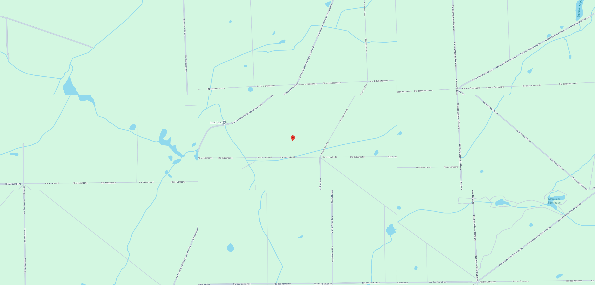
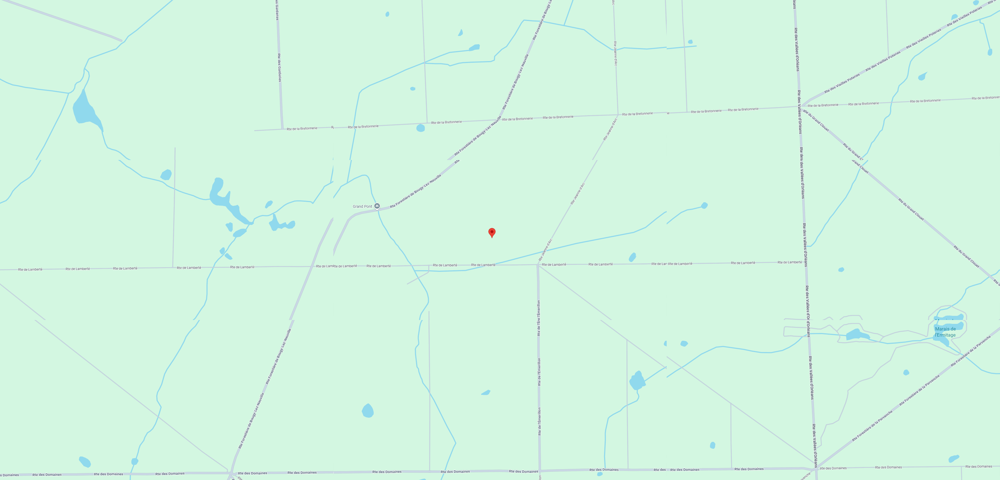
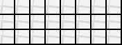
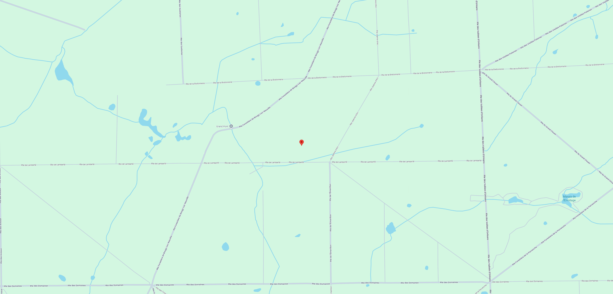
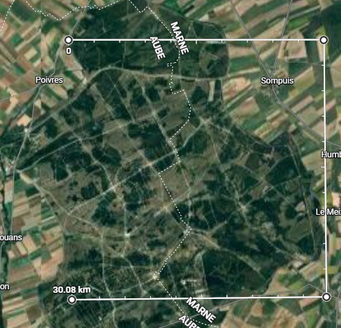

# get_area_img development

## iter_drag... methods

See [images/displacements](images/displacements). An algorithm to traverse a rectangle region made of smaller rectangle areas is made. Traversal begins from the center of the rectangular region and should go through each area EXACTLY once. Traversal also has to end on the upper edge of the region.

The idea is to connect this algorithm to the gui automation to compose larger regions of the map from areas visible on the screen at one time.

## get_area_img

Return np array representing map region. Easy - compose area screenshots into one np array, guided by `iter_drag...`

## drag_area

Interact with gui during `iter_drag...` using this method.

See gradual elimination of issues.

```python
pyautogui.moveTo(x_from, y_from)
pyautogui.dragTo(x_to, y_to, 1)
time.sleep(0.1)
```


Map gains inertia on dragTo that moves it after dragTo ends. Fix issue by introducing a short stop before releasing the mouse click.

```python
pyautogui.moveTo(x_from, y_from)
pyautogui.mouseDown()
time.sleep(0.1)
pyautogui.moveTo(x_to, y_to, 1)
time.sleep(0.1)
pyautogui.mouseUp()
time.sleep(0.1)
```


Despite the absence of inertia, some displacement are present. See the body of water to the right of the center.

Run `get_area_img` multiple times, see high similarity of images. Suspect high precision - low accuracy of displacemenets.
Develop new `is_no_change` based on pixel difference to replace the old one based on ImageChops diff bbox, now called `strict_no_change`.
Check similar images with `strict_no_change`, see `False` that seems incorrect.
Check similar images with `is_no_change`, see avg pixel difference less than `0.01`.
Add empirical threshold of `0.05` to decide whether two images have no change between each other.

Develop `test_drag_shift` to make sure that displacements are stable. As seen here, they are.



Increase accuracy of `drag_area`: scale factor - no; corrective second drag - no

Final solution!
Relies on close examination of how google maps drag works. The drag begins when the mouse cursor travels 4 pixels with mouse down.

```python
# google maps pics up dragging on 4th pixel with mousedown !!!
pyautogui.moveTo(x_from - 3, y_from)
pyautogui.mouseDown()
time.sleep(0.1)
pyautogui.moveTo(x_from, y_from, 0.1)
pyautogui.moveTo(x_to, y_to, 0.3)
time.sleep(0.1)  # small stop needed to prevent inertia from moving areas further
pyautogui.mouseUp()
time.sleep(0.1)
```


In satellite view, each area loads in a different amount of time, sometimes longer that 0.1 sec, making a constant wait time unreliable. Add `wait_for_animation_end` to account for that.

```python
    """Replicate dragging the map by providing two sets of coordinates: where the dragging begins and where it ends."""
    # google maps pics up dragging on 4th pixel with mousedown !!!
    pyautogui.moveTo(x_from - 3, y_from)
    pyautogui.mouseDown()
    time.sleep(0.1)
    pyautogui.moveTo(x_from, y_from, 0.1)
    with wait_for_animation_end(region=None):
        pyautogui.moveTo(x_to, y_to, drag_duration)
        # time.sleep to prevent inertia from moving areas further - already accounted for
    pyautogui.mouseUp()
    time.sleep(0.1)
```

# Map projection

dd = decimal degrees

Google Maps uses Web Mercator projection:
- Sphere-to-cylinder conformal projection (preserve local angles and shapes)
- Straight meridians and parallels
- Distortion near the poles
- Poles are omitted (latitude is clamped before 90 deg)

Interpretation for rectangles of same pixel width and height (screenshots):
- latitude-longitude lines form a near-square projection grid
- Same pixel with covers same width in degrees everywhere
- Same pixel width covers less real distance near poles (projection distortion)
- Same pixel height covers less height in degrees near poles (projection distortion)
- Same degree height covers same real distance, but due to the previous point, \
  same pixel height covers less real distance near poles.

Corollaries:
- Larger regions require attention:
  - When estimating how many areas are in a region (r_width x r_height), the dd height of the center area is used. Since dd height of center area will be considerably smaller than dd height of areas at the bottom of the region, this may lead to overestimation. Even if r_height is overestimated by 1, it will lead to at least 2\*r_width unnecessary area scans, leading to detrimental processign time increase. A special scaling factor for area height that depend on latitude should be introduced to make r_height estimation more precise.
  - During path planning, there will be less meters per pixel near the poles. If only the pixel distance is taken into account, two paths with same pixel distance with one near the poles will be falsely evaluated as equivalent, although the one near the poles is better. A special factoring matrix should be introduced to account for the distortion, or the image itself must be rescaled.

The largest of the processed areas below shows the current scale - 0.2 deg (about 20km).



At this scale all drawbacks of the projection can be ignored. Meters per pixel, as well as degrees per pixel, are almost linear, making the screenshots perfectly usable as-is for tasks of path planning.

## Proof for degrees on rectangles with same pixel dimensions:
- Area at (2.160845852872219, 50.05395239601597)
  -  area_width_dd=0.01291751878432379
  -  dwidth=0.0
  -  area_height_dd=0.0039886770449015785
  -  dheight=0.0
- Area at (2.160845852872219, 51.0212088046068)
  - area_width_dd=0.01291751878432379
  - dwidth=0.0
  - area_heigth_dd=0.003907713118174172
  - dheight=0.0

1 deg in latitude ~ 0.0001 deg change in deg-per-pixel
